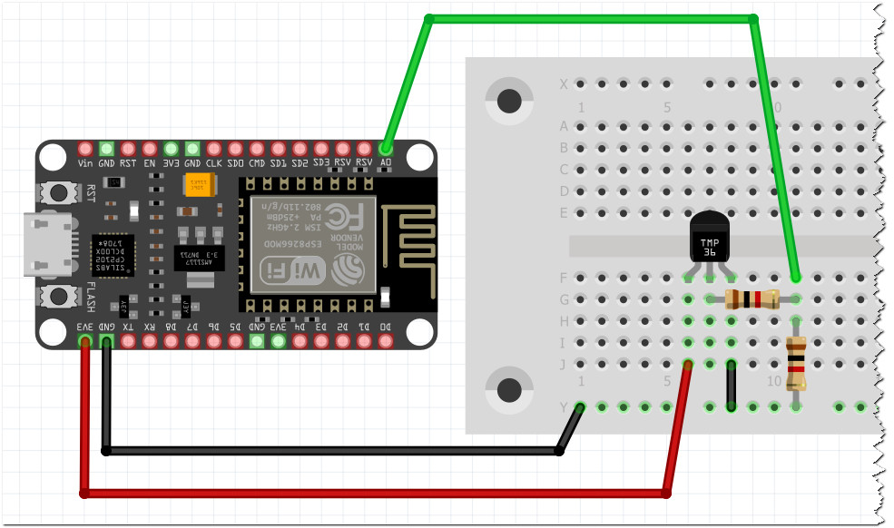

# ESP8266_Projekter
## Huzzah Feather A0 RAW

Her læses A0 (den eneste ADC på ESP8266)
Den rå ADC værdi Volt omregnet og beregnet temperatur vises på dette format

```
389.00, 0.70, 19.71 degrees C
388.00, 0.70, 19.53 degrees C
```

Det kan være du selv skal beregne en anden faktor end de `1.835`

Jeg har brugt 2 x 1k Ohm modstande til at sørge for at A0 ikke får mere end 1.0 Volt.

 

