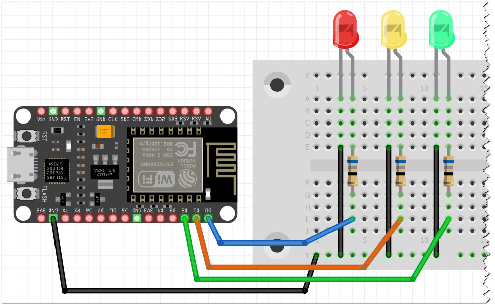

# ESP8266_Projekter
## Huzzah Html LED control

Dette er et eksempel fra Sensors bogen fra Systime.

Her sættes ESP8266´eren op som en HTML server, som vil forsøge at
få en lokal adresse på dit wifi.

Når du har den kørende og der skrives en IP i Serial Monitoren
så åbn siden på din mobil - Bare skriv IP adressen.
Hvis mobilen er på samme netværk, så burde du kunne se 3 knapper
og hvis du trykker på dem, så skal den pågældende LED begynde at lyse,
og på din mobil, skal du kunne se at den er sat til at lyse.

> [!IMPORTANT]
> Du skal selv skrive information ind i `wifi_secrets.h` filen, som ligger
> sammen med kodefilen.

> [!NOTE]
> På billedet herunder er det en NodeMCU ESP8266.
> Den har lidt andre forbindelser, så check efter om du bruger
> en HUZZAH eller en NodeMCU, og vælg pins derefter.
> Modstandende er på 68 Ohm, da Huzzah'en kører på 3.3 Volt

 

